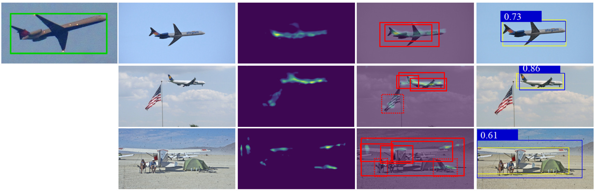

# SDM-RAN

This repository contains the demos for paper **Identify an Object Unseen Before At Once without Fine-tuning**.
## Abstract
Given one or a couple of photos of an object unseen before, humans can find it immediately in different scenes. Though the human brain mechanism behind this phenomenon is still not fully discovered, this work introduces a novel engineering realization of this task. It consists of two steps: (1) Generating a **Similarity Density Map (SDM)** by convoluting the scene image using the given object image patch(es) so that the highlight areas in SDM indicate the possible locations of the object; (2) Obtaining the object occupied areas in the scene through a **Region Align Network (RAN)**. RAN is constructed on a backbone of Deep Siamese Network (DSN) and different from the traditional DSNs, RAN aims to obtain the objects region according to the location and box differences between the ground truth and the predicted one around the highlight areas in SDM. With the pre-learning on the annotated labels given by traditional datasets of RAN, the proposed SDM-RAN can identify an object unseen before at once without fine-tuning or re-training. Experiments are carried out on COCO dataset for object detection, and FSC-147 dataset for object counting. The results indicate the proposed method outperforms the state-of-the-art methods on related tasks.
## Installation
+ Install PyTorch:
```
conda install pytorch=1.12.0 torchvision torchaudio cudatoolkit=11.7 -c pytorch
```
+ Install necessary packages with `requirements.txt`
```
pip install -r requirements.txt
```
+ Download the model weights files using following URLs
1. Siamese.pt
    ```
    https://drive.google.com/file/d/19Ga696qZKdwLGhIBb2EdoK2FkKovtCF8/view?usp=share_link
    ```
    Move to the path: `SDM-RAN/FSOD-AO/data/models/Siamese.pt`  
  2. RAN.pt
    ```
    https://drive.google.com/file/d/145s_OeErMBGoQBs9NOMnwNCSn8pGp6gM/view?usp=share_link
    ```
    Move to the path: `SDM-RAN/VCount/util/RAN.pt`  
#### The code was developed and tested with Python 3.8, Pytorch 1.12.0, and opencv 4.6.0
## Code Directory Structure
```
├── SDM-RAN
│   ├── FSOD-AO
│   │   ├── detect.py -> python file for detection									
│   │   │   ├── utils -> the definition files of SDM and RAN
│   │   │   ├── data -> the auxiliary models and labels file folder
│   │   │   │   ├── models -> the weight files for SDM and RAN
│   │   │   │   ├── annotations -> the annotations of coco_train and coco_val
│   │   │   ├── detect
│   │   │   │   ├── [category_id]
│   │   │   │   │   ├── support -> the k-shot support images
│   │   │   │   │   ├── query -> the query images
│   │   │   │   │   ├── result -> the visualization results of detection
│   ├── VCount
│   │   ├── VCount.py -> python file for visual counting
│   │   │   ├── utils -> the definition files of SDM and RAN
│   │   │   ├── data -> the dataset
│   │   │   │   ├── images_384_VarV2 -> FSC-147 images
│   │   │   │   ├── annotation_FSC147_384.json -> the annotations of FSC-147
│   │   │   │   ├── split.json -> the index file for val, test, and visualization set
```
